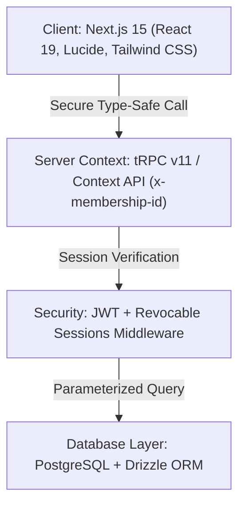
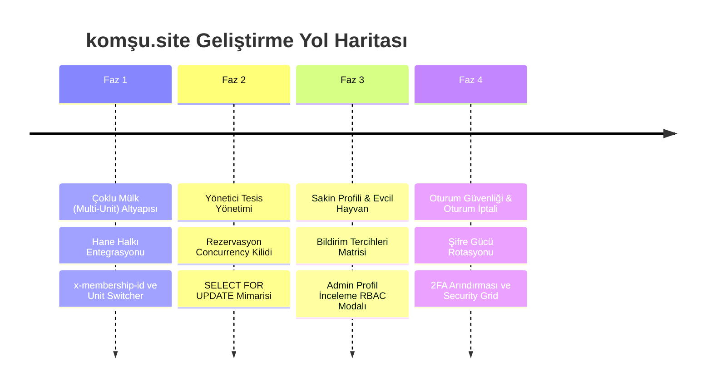
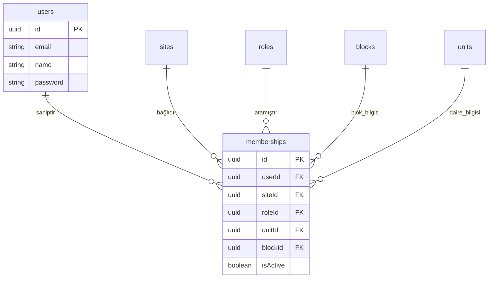
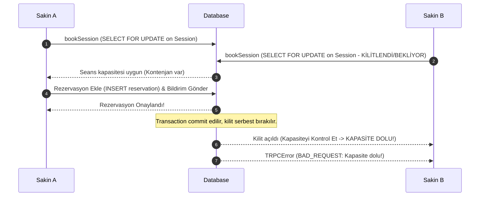
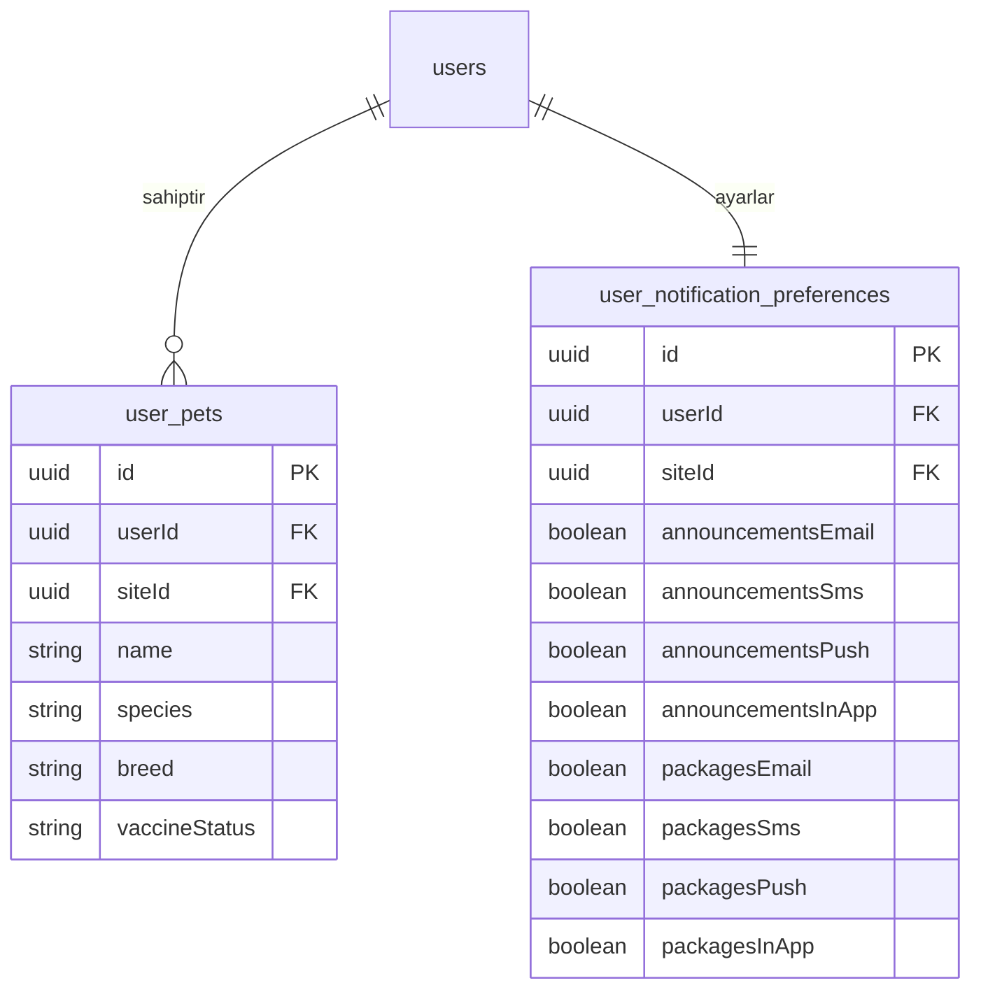
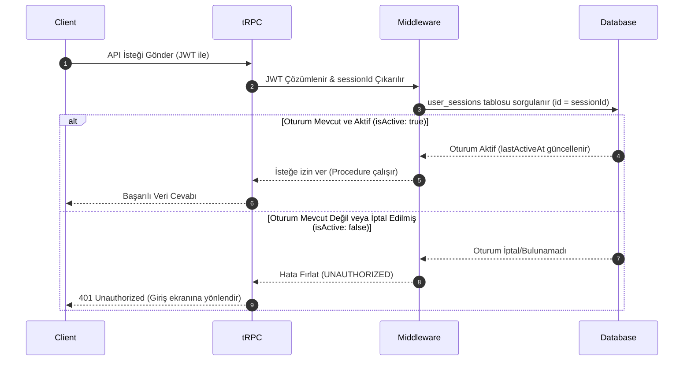

# 🏢 komşu.site (Apartman Plus Resident Operations)

komşu.site (apartman-plus-resident-ops), modern rezidans, toplu konut ve apartman yaşam operasyonlarını kolaylaştırmak için tasarlanmış, birinci sınıf **B2B SaaS Resident Portal** ürünüdür. Yüksek güvenlik standartları, çoklu mülk desteği, çakışmasız rezervasyon algoritmaları ve göz alıcı cam görünümlü (glassmorphism) modern teması ile apartman sakini ve yönetim deneyimini yeniden tanımlamaktadır.

Platform, **ASANMOD Enterprise** standartlarına tam uyumlu olarak, uçtan uca tip güvenliği (type-safety) ve modüler mimari prensipleri doğrultusunda geliştirilmiştir.

---

## 🏗️ 1. Sistem Mimarisi ve Teknoloji Yığını

komşu.site mimarisi, ölçeklenebilirlik, veri bütünlüğü ve sıfır güven (zero-trust) prensiplerine göre katmanlandırılmıştır.



### 🛠️ Teknoloji Katmanları

- **Frontend**: Next.js 15 (React 19) App Router mimarisi ile sunucu tarafı öncelikli (RSC) veri yükleme.
- **UI Tasarımı**: Premium Glassmorphism tasarımı, özel HSL renk paleti, Lucide simgeleri, dinamik mikro animasyonlar ve tamamen duyarlı (responsive) grid sistemi.
- **API Gateway**: tRPC v11. Frontend ve Backend arasında %100 tip güvenliği (type-safe) ve derleme aşamasında hata yakalama yeteneği.
- **Veritabanı & ORM**: Drizzle ORM ile yönetilen PostgreSQL veritabanı. Tüm veritabanı sorguları parametrize edilmiş olup, SQL injection açıklarına karşı tam korumalıdır.
- **Çekirdek Kurallar**: Her bir frontend dosyası 180 satırın, her bir backend tRPC router dosyası ise 220 satırın altında tutulacak şekilde modülerleştirilmiştir.

---

## 🚦 2. Dört (4) Ana Geliştirme Fazı

komşu.site platformu, planlanmış 4 ana operasyonel ve teknik faz kapsamında geliştirilmiştir:



---

## 🚀 FAZ 1: Çoklu Mülk (Multi-Unit) Altyapısı ve Hane Halkı Entegrasyonu

Klasik tek sakin - tek daire ilişkisi kırılarak, bir kullanıcının site genelinde birden fazla aktif üyeliğe sahip olabilmesi (malik, kiracı, sakin vb.) ve tek tıklamayla bu mülkler arasında geçiş yapabilmesi sağlanmıştır.

### 🧬 Veri Modeli ve İlişkisel Şema

Kullanıcının üyelikleri `memberships` pivot tablosu üzerinden çoklu mülk yapısına bağlanır:



### 🔌 `x-membership-id` ile tRPC Context Akışı

API yetkilendirmesi, istemcinin istek başlığı (`headers`) üzerinden ilettiği **`x-membership-id`** parametresine dayanır. `createContext` fonksiyonunda yetkilendirme şu şekilde işletilir:

1.  Gelen istek başlıklarından `x-membership-id` okunur.
2.  Kullanıcının veritabanında bu üyeliğe sahip olup olmadığı ve üyeliğin aktiflik durumu (`isActive: true`) denetlenir.
3.  Eğer `x-membership-id` iletilmemişse (veya geriye dönük uyumluluk gerekiyorsa), kullanıcının o sitedeki ilk aktif üyeliği otomatik olarak context'e bağlanır.

```typescript
// src/server/trpc.ts içindeki Context Çözümleme Mantığı
const membershipId = opts.req?.headers.get("x-membership-id");

if (user && membershipId && membershipId !== "undefined") {
  const [record] = await db
    .select()
    .from(memberships)
    .where(
      and(
        eq(memberships.id, membershipId),
        eq(memberships.userId, user.userId),
        eq(memberships.isActive, true),
      ),
    )
    .leftJoin(roles, eq(memberships.roleId, roles.id));

  if (record) {
    activeMembership = {
      id: record.memberships.id,
      siteId: record.memberships.siteId,
      unitId: record.memberships.unitId,
      blockId: record.memberships.blockId,
      roleId: record.memberships.roleId,
      roleName: record.roles?.name || "User",
      permissions: record.roles?.permissions || [],
    };
  }
}
```

### 🎛️ UX/UI Kararı: Mülk Değiştirici (Unit Switcher)

Sakinlerin dashboard üzerinden aktif dairelerini kolayca seçebilmesi için parıltılı cam görünümlü (`glass-panel`) interaktif bir **Unit Switcher** dropdown bileşeni yerleştirilmiştir. Dropdown üzerinde blok adı, daire numarası ve kullanıcının o dairedeki rolü (örn: _"B Blok Daire 14 - KİRACI"_) hiyerarşik olarak listelenir. Seçim yapıldığı anda istek başlıklarındaki `x-membership-id` anında güncellenerek dashboard verileri çabucak yenilenir.

---

## 📅 FAZ 2: Yönetici Tesis Yönetimi ve Rezervasyon Concurrency Kilidi

Sosyal tesislerin (havuz, gym, tenis kortu vb.) yöneticiler tarafından dinamik slot ve kapasitelerle kurulmasını ve sakinlerin çakışma olmadan rezervasyon yapabilmelerini sağlayan rezervasyon motorudur.

### 🔒 PostgreSQL Row-Level Locking (Satır Seviyesinde Kilitleme)

Aynı rezervasyon slotuna eşzamanlı (paralel) gelen isteklerde, kapasite aşımını ve mükerrer rezervasyonu kesin olarak önlemek amacıyla **PostgreSQL Row-Level SELECT FOR UPDATE** mekanizması Drizzle transaction bloğu içerisinde kurgulanmıştır.



### 💻 Rezervasyon Kilitleme Kod Yapısı

`src/server/routers/booking.ts` içerisindeki Drizzle Transaction yapısı:

```typescript
return ctx.db.transaction(async (tx) => {
  // 1. İlgili seans satırı SELECT ... FOR UPDATE ile kilitlenir.
  const [session] = await tx
    .select()
    .from(amenitySessions)
    .where(eq(amenitySessions.id, input.sessionId))
    .for("update"); // Row-level locking!

  if (!session || !session.isActive) {
    throw new TRPCError({
      code: "NOT_FOUND",
      message: "Aktif seans bulunamadı",
    });
  }

  // 2. Mevcut onaylı rezervasyonlar sayılır.
  const [existingCount] = await tx
    .select({ count: sql<number>`count(*)` })
    .from(amenityReservations)
    .where(
      and(
        eq(amenityReservations.sessionId, input.sessionId),
        eq(amenityReservations.reservationDate, input.reservationDate),
        eq(amenityReservations.status, "CONFIRMED"),
      ),
    );

  // 3. Kapasite aşımı kontrol edilir.
  if (Number(existingCount?.count || 0) >= session.capacity) {
    throw new TRPCError({
      code: "BAD_REQUEST",
      message: "Kapasite dolu! Seçilen seans için tüm kontenjan dolmuştur.",
    });
  }

  // 4. Rezervasyon eklenir.
  const [reservation] = await tx
    .insert(amenityReservations)
    .values({
      siteId: ctx.activeMembership!.siteId,
      sessionId: input.sessionId,
      userId: ctx.user.userId,
      reservationDate: input.reservationDate,
      status: "CONFIRMED",
    })
    .returning();

  return reservation;
});
```

---

## 🐶 FAZ 3: Sakin Profili, Evcil Hayvan Kaydı ve Admin İnceleme Arayüzü

Sakinlerin acil durum iletişim bilgilerini, sosyal çevrelerini (evcil hayvan kayıtları) ve sistem bildirim tercihlerini granular düzeyde yönettiği kapsamlı veri kümesidir.

### 📊 Bildirim Tercihleri Matrisi ve İlişkisel Şema

- **Kişisel Veriler (`users`)**: Telefon numarası, acil durum yakını adı ve acil durum telefonu alanları ile güçlendirilmiştir.
- **Evcil Hayvanlar (`user_pets`)**: Evcil hayvanın ismi, türü, cinsi, aşı durumu (`vaccineStatus`) ve ek notlarını içeren ilişkisel tablo.
- **Bildirim Tercihleri Matrisi (`user_notification_preferences`)**: Duyurular, Kargolar, Ziyaretçiler ve Rezervasyonlar olmak üzere 4 ana kategorinin; E-Posta, SMS, Mobil Push ve In-App olmak üzere 4 kanaldaki izinlerini (4x4 matris) bağımsız olarak tutar.



### 🛡️ RBAC Korumalı Admin Profil İnceleme Modalı

Yöneticiler, Sakin Yönetimi panelinde sakinlerin yanındaki "Profili İncele" butonu ile sakinin detay profiline, evcil hayvanlarına ve bildirim tercihlerine erişebilirler.

- API düzeyinde (`user.getResidentProfileForAdmin`), istek atan kullanıcının `SUPER_ADMIN` veya ilgili sitenin aktif `SITE_ADMIN` yetkisine sahip olup olmadığı sıkı şekilde denetlenir. Yetkisiz sakinlerin diğer sakinlerin gizli verilerine erişmesi tırnak ucu kadar bile mümkün olmayacak şekilde engellenmiştir.

---

## 🔒 FAZ 4: Hesap Güvenliği, Oturumlar ve Şifre Rotasyonu (2FA Arındırması)

Hesap güvenliğini veri ve oturum seviyesinde en üst düzeye çıkaran, gereksiz karmaşıklıktaki 2FA yerine kullanıcı dostu oturum yönetimine odaklanan son fazdır.

### 🎟️ Hibrit Session Middleware Yetkilendirmesi

Kullanıcının aktif oturumları `user_sessions` tablosunda (istemcinin tarayıcı bilgisi, IP adresi, son aktif zamanı ve aktiflik durumu) anlık olarak izlenir.



### 🔑 2FA Arındırması ve Güvenli Giriş

Karmaşık ve sakinleri zorlayan eski Google Authenticator (TOTP) 2FA kurgusu ve kütüphaneleri sistemden tamamen arındırılarak `users` tablosundan temizlenmiştir. `LoginFormCard.tsx` doğrudan yüksek performanslı standart email/şifre formuna dönüştürülmüştür.

### 📐 UX/UI Tasarım Kararı: Security Grid Düzeni

Hesap Güvenliği sekmesinde, dengeli ve premium bir görsel yerleşim oluşturmak amacıyla ekran yan yana iki karta bölünmüştür:

1.  **Şifre Değiştirme Kartı (col-span-5)**: Mevcut şifreyi doğrulatan, yeni şifreyi büyük/küçük harf, rakam ve uzunluk kriterlerine göre gerçek zamanlı denetleyen interaktif form.
2.  **Oturum Yönetimi Kartı (col-span-7)**: Sakinin o an aktif olan tüm oturumlarını listeler. Mevcut cihazı _"Bu Cihaz"_ etiketiyle vurgular. Sakine, şüpheli veya eski diğer cihazlardaki oturumları tek tıkla sonlandırma (`revokeSession` API) yeteneği verir.

---

## 🎨 3. UX/UI Görsel Standartları ve Glassmorphism

komşu.site arayüz tasarımı, kullanıcılara lüks ve premium bir SaaS yazılımı hissi vermek amacıyla özenle tasarlanmıştır.

- **Cam Efekti (Glassmorphism)**: Kartlar ve paneller yarı şeffaf buzlu cam dokusuna (`bg-white/[0.02] backdrop-blur-md`) sahiptir. Kart sınırları ince parıltılı beyaz çizgilerle (`border-white/[0.04]`) çevrilidir.
- **Harmonik Renk Paleti**: Göz yoran saf ana renkler yerine zengin zümrüt yeşili, derin indigo ve şık koyu gri tonları HSL renk sistemiyle (`text-primary`, `bg-primary`) harmanlanmıştır.
- **Dinamik Mikro Animasyonlar**: Butonlarda hafif gölge parıltıları (`shadow-glow`), sekmeler ve sayfalar arası geçişlerde yumuşak sönümleme ve kayma animasyonları (`animate-fade-in transition-all duration-300`) uygulanmıştır.
- **Tam Duyarlılık (Responsive Layout)**: Dashboard, mobil telefonlardan 4K geniş ekranlara kadar kusursuz grid ölçeklemesi sunar.

---

## ⚡ 4. PM2 Mod Araçları ve CLI Hata/Teşhis Komutları

Uygulamanın sunucu ve süreç yönetimi, **ASANMOD v10.0 AI-Responsive PM2** entegrasyonu ile yürütülmektedir. Proje yöneticileri ve AI ajanları için sunulan kritik PM2 mod komutları şunlardır:

### ⚙️ Standart Süreç Yönetimi

| Komut                                   | Açıklama                                              |
| :-------------------------------------- | :---------------------------------------------------- |
| `./scripts/mod-tools/pm dev status`     | Geliştirme (dev) sunucusunun anlık durumunu gösterir. |
| `./scripts/mod-tools/pm dev restart`    | Geliştirme sunucusunu yeniden başlatır.               |
| `./scripts/mod-tools/pm prod status`    | Üretim (production) sunucusunun durumunu gösterir.    |
| `./scripts/mod-tools/pm prod restart`   | Üretim sunucusunu yeniden başlatır.                   |
| `./scripts/mod-tools/pm prod logs`      | Üretim sunucusunun son 100 satır logunu döker.        |
| `./scripts/mod-tools/pm prod logs-live` | Canlı akan üretim loglarını ekrana yansıtır.          |

### 🤖 AI-Responsive Teşhis ve Hata Arama Komutları

| Komut                                | Açıklama                                                          |
| :----------------------------------- | :---------------------------------------------------------------- |
| `./scripts/mod-tools/pm dev errors`  | Geliştirme sunucusundaki güncel hataları UTC+3 zamanında tarar.   |
| `./scripts/mod-tools/pm prod errors` | Üretim ortamındaki kritik hataları tarar ve raporlar.             |
| `./scripts/mod-tools/pm dev diag`    | Geliştirme sunucusu için tam teşhis (diagnostic) raporu hazırlar. |
| `./scripts/mod-tools/pm prod diag`   | Üretim sunucusu için tam teşhis raporu hazırlar.                  |
| `./scripts/mod-tools/pm dev health`  | Uygulama servislerinin genel sağlık taramasını yapar.             |
| `./scripts/mod-tools/pm dev memory`  | Süreçlerin RAM tüketim limitlerini ve sızıntılarını denetler.     |

---

## 🧪 5. Proje Kalite Kapıları ve Test Protokolleri

Platformun kararlılığı, her faz sonunda koşturulan kapsamlı **E2E Integration Test** betikleri ve **Universal Quality Gates** ile güvence altına alınmıştır:

### 🔍 E2E Entegrasyon Test Suite

- `verify-ops.ts`: Çoklu mülk yetkilendirmesi ve daire geçişleri testi.
- `verify-booking.ts`: Rezervasyon concurrency kilidi ve eşzamanlı çakışma engelleme testi.
- `verify-profile-pets.ts`: Sakin evcil hayvan CRUD ve 4x4 bildirim matrisi testi.
- `verify-admin-inspection.ts`: Yönetici sakin profili inceleme (RBAC) güvenlik yetkilendirmesi testi.
- `verify-security-sessions.ts`: Şifre değiştirme ve aktif oturum sonlandırma (session revoke) testi.

### 🛡️ Evrensel Kalite Kapıları (`Universal Gates`)

Projenin derlenebilirliği ve standartları `npm run verify` komutu ile tek adımda denetlenir. Bu komut şu kalite adımlarını koşturur:

```bash
npm run verify           # Genel kalite kapısını koşturur (TypeScript + ESLint + Prettier + Mimari)
npm run format:write     # Prettier ile tüm dosyaları standartlara göre biçimlendirir.
npm run fix              # ESLint hatalarını otomatik düzeltir.
```

1.  **TypeScript (tsc)**: Derleme ve tip güvenliği testi.
2.  **ESLint**: Kod kalite standartları testi.
3.  **Prettier**: Kod stili biçimlendirme testi.
4.  **Modular Architecture Check**: Frontend dosyalarının 180 satır, backend router'ların 220 satır altında olduğunu tescilleyen katı mimari kontrolü (`npm run modular:check`).
