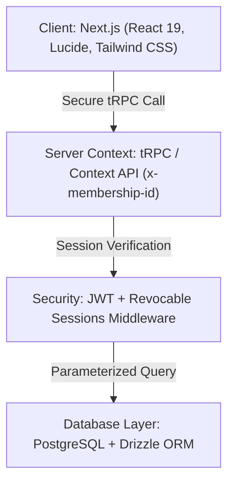
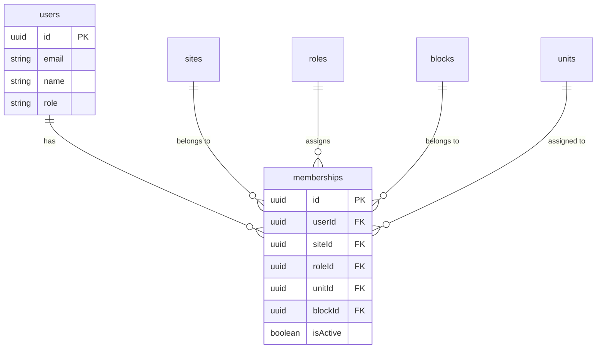
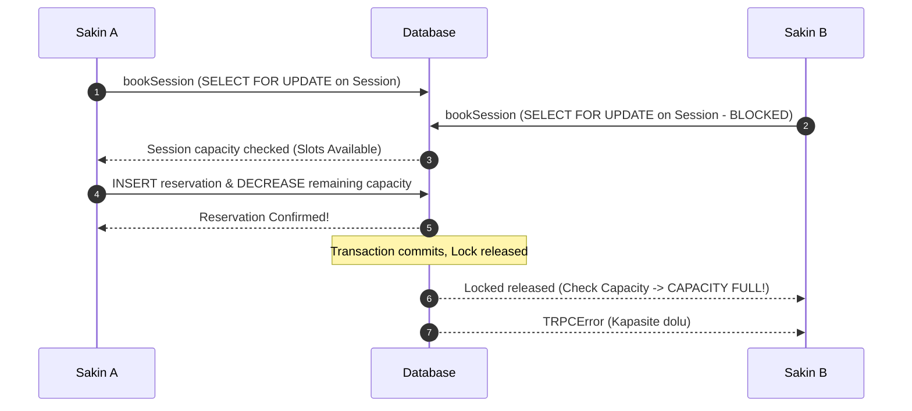
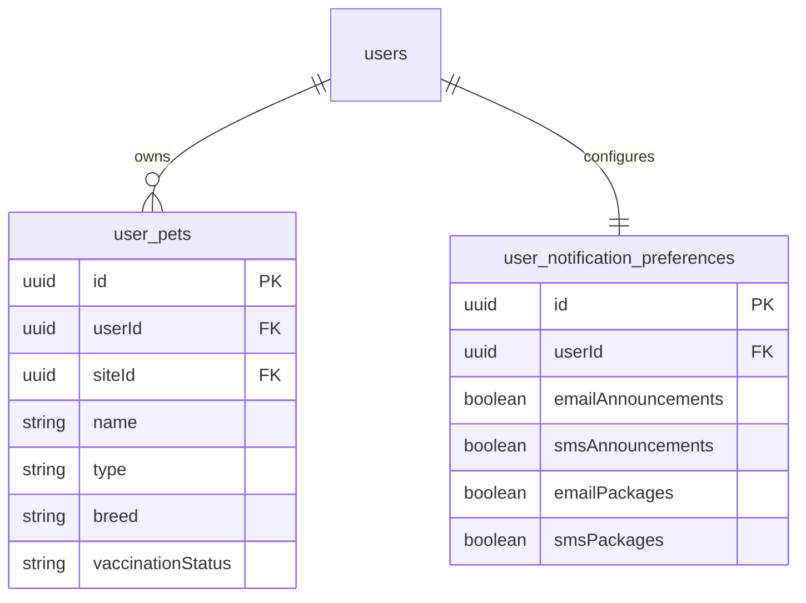
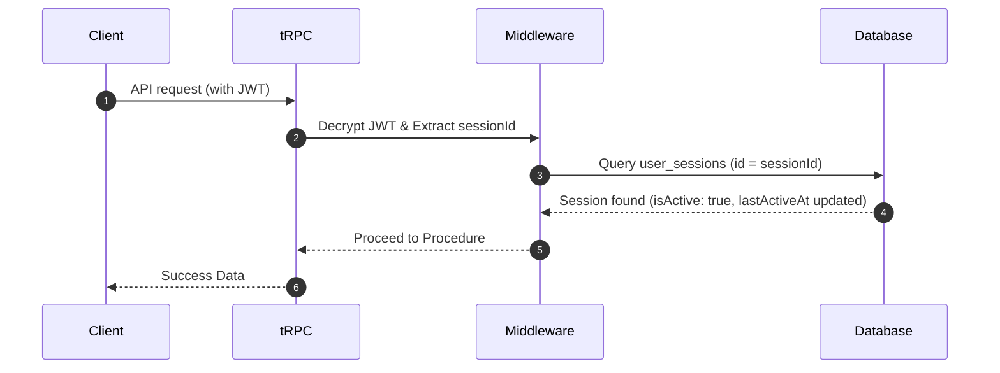

# 🏢 Apartman Plus Resident Ops - Kapsamlı Ürün Modellemesi ve Geliştirme Raporu

Bu rapor, **Apartman Plus Resident Ops** platformu kapsamında gerçekleştirilen 4 ana geliştirme fazının işlevsel modellemesini, teknik mimarisini, veri şemalarını, tRPC API tasarımlarını ve kullanıcı deneyimi (UX/UI) kararlarını en detaylı haliyle belgelemektedir.

---

## 🗺️ 1. Giriş ve Vizyon

**Apartman Plus Resident Ops**, modern rezidans ve toplu konut yaşamlarında karşılaşılan operasyonel zorlukları aşmak için tasarlanmış yüksek güvenlikli, çoklu mülk destekli ve dinamik operasyonel süreç yönetimi sunan enterprise düzeyde bir SaaS ürünüdür.

Platformun ana felsefesi:

- **Çoklu Daire Desteği:** Bir sakinin aynı site içerisinde malik, kiracı veya sakin olarak birden fazla daireye sahip olabilmesi ve tek tıklamayla bu roller/daireler arasında geçiş yapabilmesi.
- **Dinamik Kaynak Yönetimi:** Sosyal tesislerin (havuz, gym, etkinlik alanları vb.) yöneticiler tarafından esnek slotlarla yönetilmesi ve çakışmasız rezervasyon yapılması.
- **Sakin Merkezli Deneyim (UX/UI):** Granular bildirim tercihleri ve evcil hayvan kayıtları gibi modern operasyonel gereksinimlerin cam efektli (glassmorphic) görsel dille harmanlanması.
- **Sıfır Güven (Zero-Trust) Hesap Güvenliği:** Aktif oturumların (session) anlık olarak izlenmesi, coğrafi IP/cihaz tespiti ve tek tıkla oturum sonlandırma yeteneği.

---

## 🛠️ 2. Sistem Mimarisi ve Teknoloji Yığını

Platform, **ASANMOD Enterprise** standartlarında, sürdürülebilir ve yüksek performanslı modern web teknolojileri ile inşa edilmiştir:

- **Çekirdek:** HTML5 ve JavaScript/TypeScript.
- **Arayüz (UI):** Premium Cam Efekti (Glassmorphism), HSL özel renk paleti, Lucide simgeleri, dinamik mikro animasyonlar ve tamamen duyarlı (responsive) grid sistemi.
- **Sunucu & API:** Next.js App Router üzerinde koşan **tRPC v11**. Bu sayede frontend ve backend arasında %100 tip güvenliği (type-safety) sağlanmıştır.
- **Veritabanı & ORM:** Drizzle ORM ile yönetilen PostgreSQL veritabanı. Tüm sorgular parametrize edilmiş ve SQL enjeksiyonlarına karşı tam korumalıdır.
- **Mimari Kurallar:** Tüm frontend sayfalarının 180 satır, tRPC router dosyalarının ise 220 satır altında kalmasını zorunlu kılan **Modular Architecture** prensipleri uygulanmıştır.

---

## 🧬 3. Geliştirme Fazları ve Ayrıntılı Modelleme

### 🚀 FAZ 1: Çoklu Mülk (Multi-Unit) Altyapısı ve Hane Halkı Entegrasyonu

Bu fazın temel amacı, klasik tek daire/tek sakin ilişkisini kırarak esnek bir üyelik yapısı oluşturmaktır.

#### A. Veri Modeli ve İlişkisel Şema (Database Schema)

Sakinlerin birden fazla üyeliğe sahip olabilmesi için `memberships` tablosu pivot haline getirilmiştir:

- **`claimInvitation` API Esnekliği:** Sakinin _"Zaten bu sitenin aktif bir üyesisiniz"_ engeli kaldırılarak, aynı kullanıcının farklı daireler (units) için birden fazla aktif `membership` kaydı edinebilmesi sağlanmıştır. Ancak aynı daireye mükerrer kayıt engeli sürdürülmektedir.

#### B. tRPC Context Yetkilendirme Değişiklikleri

Tüm korumalı prosedürlerde (`protectedProcedure`), kullanıcının yaptığı işlemler istek başlığındaki (`headers`) **`x-membership-id`** parametresine bağlanmıştır.

- İstek anında kullanıcının o üyeliğe gerçekten sahip olup olmadığı ve üyeliğin aktiflik durumu veritabanından denetlenir.
- Geriye dönük uyumluluk için `x-membership-id` gönderilmemişse, kullanıcının o sitedeki ilk aktif üyeliği otomatik olarak context'e atanır.

#### C. UX/UI Tasarım Kararları (Unit Switcher)

- Sakinlerin daireler arasında kaybolmadan geçiş yapabilmesi için dashboard panelinin üst kısmına cam efektli (`glass-panel`) **Mülk Değiştirici (Unit Switcher)** dropdown bileşeni yerleştirilmiştir.
- Dropdown üzerinde sakinin daire numarası, blok adı ve o dairedeki rolü (örn: _"A Blok Daire 12 - SAKİN"_) net ve okunabilir bir hiyerarşide listelenir. Seçim yapıldığında tRPC context başlığı anında güncellenerek dashboard verileri yenilenir.

---

### 📅 FAZ 2: Yönetici Tesis Yönetimi ve Rezervasyon Concurrency Kilidi

Tesis rezervasyonlarında çakışmaları tamamen ortadan kaldıran dinamik parametreli bir yönetim motorudur.

#### A. Veri Modeli ve Tesis Şeması

- **`amenity_sessions` Tablosu:** Her tesis için haftalık planlar (`dayOfWeek`, `startTime`, `endTime`, `capacity`) tanımlanır.
- **`amenity_reservations` Tablosu:** Sakinlerin rezerve ettiği slotları tutar.

#### B. Rezervasyon Concurrency Çözümü (Row-Level Locking)

Platformun en kritik teknik çözümlerinden biri, aynı anda gelen rezervasyon isteklerinin çakışmasını önleyen **PostgreSQL Row-Level Locking** mimarisidir:

Bu işlem `booking.ts` router'ı içerisinde Drizzle transaction bloğunda şu şekilde modellenmiştir:

1. İlgili `session` satırı `SELECT ... FOR UPDATE` ile kilitlenir.
2. Mevcut rezervasyon sayısı dinamik olarak sayılır.
3. Kapasite aşılmamışsa rezervasyon kaydedilir ve işlem sonlandırılır.
4. Çakışan diğer paralel istekler kilit çözülene kadar bekletilir, ardından kapasite kontrolüne takılarak kontrollü hata (`TRPCError - Kapasite dolu`) alırlar.

#### C. UX/UI Tasarım Kararları

- **Yönetici Paneli:** Tesislerin kapasite, saat ve slot hiyerarşisini kolayca düzenleyebilecekleri grid kart düzeni.
- **Sakin Arayüzü:** Günlük doluluk oranlarını görselleştiren, kapasitesi dolan saatleri pasifize eden interaktif rezervasyon takvimi.

---

### 🐶 FAZ 3: Sakin Profili, Evcil Hayvan Kaydı ve Admin İnceleme Ekranı

Sakinlerin yaşam alanlarındaki varlıklarını (aile bireyleri, acil durum kontakları ve evcil hayvanlar) eksiksiz yönetebilmeleri ve bu verilerin site güvenliği/yöneticilerle kontrollü paylaşımıdır.

#### A. Veri Modeli ve Şemalar

- **Kişisel Veriler (`users`):** Telefon numarası (`phoneNumber`), acil durum yakını adı (`emergencyContactName`) ve acil durum telefonu (`emergencyContactPhone`) kolonları eklendi.
- **Evcil Hayvanlar (`user_pets`):** Evcil hayvan ismi, türü, cinsi ve aşı takip bilgilerini içeren bağımsız ilişkisel tablo.
- **Bildirim Tercihleri Matrisi (`user_notification_preferences`):** Duyurular, Kargolar, Ziyaretçiler ve Rezervasyonlar kategorileri için sakinin hangi kanalı (E-Posta, SMS, Mobil Push, In-App) aktif etmek istediğini granular (1/0) bazda tutan matris.

#### B. Yönetici İnceleme Ekranı ve RBAC Güvenliği

- Yöneticilerin sakin listesinde (`MemberManager.tsx`) "Profili İncele" göz butonuna tıklayarak açtıkları **`ResidentProfileModal`** paneli tasarlanmıştır.
- Bu modal sakinlerin acil durum kontaklarını, evcil hayvanlarını ve bildirim matrisini tek bir read-only ekranda toplar.
- API seviyesinde (`user.inspectResidentProfile`), isteği yapan kullanıcının `SITE_ADMIN` yetkisine sahip olup olmadığı sıkı şekilde kontrol edilir. Sakin rolündeki kullanıcıların bu API'ye erişimi tırnak ucu kadar bile mümkün olmayacak şekilde engellenmiştir (RBAC yetki koruması).

#### C. UX/UI Tasarım Kararları

- **Bildirim Matrisi Tablosu (`NotificationTab.tsx`):** Toggle switch'lerden oluşan, matris yapısında, arka planı buzlu cam efektiyle yumuşatılmış ultra modern panel tasarımı.
- **Satır Sınırı Optimizasyonları:** Arayüzün 180 satır sınırını aşmaması için matris kısmı `ResidentPreferenceMatrix.tsx` alt bileşenine; evcil hayvan ekleme formu ise `PetAddForm.tsx` bileşenine taşınarak kod modülerliği zirveye çıkarılmıştır.

---

### 🔒 FAZ 4: Hesap Güvenliği, Oturumlar ve Şifre Rotasyonu (2FA Arındırması)

Hesap güvenliğini veri ve oturum seviyesinde en üst düzeye çıkaran, gereksiz karmaşıklıktaki 2FA yerine kullanıcı dostu oturum yönetimine odaklanan son fazdır.

#### A. Veri Modeli ve Oturum Doğrulama

- **`user_sessions` Tablosu:**
  - `id`: Benzersiz UUID.
  - `userAgent`: İstekte bulunan cihazın OS/tarayıcı bilgisi.
  - `ipAddress`: Coğrafi güvenlik takibi için istemci IP'si.
  - `isActive`: Oturumun geçerlilik durumu (true/false).
  - `lastActiveAt`: Oturumun son etkin olduğu UTC zamanı.

- **Hibrit Session Middleware Yetkilendirmesi (`src/server/trpc.ts`):**
  - Next.js istek anında JWT token'dan çözülen `sessionId` verisini alır.
  - Veritabanındaki `user_sessions` kaydı sorgulanır.
  - Eğer oturum `isActive: false` (iptal edilmiş/revoked) ise veya mevcut değilse istek anında `UNAUTHORIZED` fırlatılarak reddedilir.
  - Aktif oturumlarda `lastActiveAt` zamanı anında güncellenir.

#### B. 2FA Arındırması ve LoginForm Sadeleştirmesi

- Geliştirilmiş olan Google Authenticator (TOTP) 2FA sistemi arındırılarak `users` tablosundan temizlenmiş, `totp.ts` kütüphanesi silinmiş ve `LoginFormCard.tsx` doğrudan standart email/password formuna geri dönüştürülmüştür. Bu sayede giriş performansı ve kullanıcı deneyimi en yüksek seviyeye çıkarılmıştır.

#### C. UX/UI Tasarım Kararları (Security Grid Düzeni)

- **SecurityTab Grid Yapısı:** Arayüzde dengeli bir görsel tasarım oluşturmak amacıyla iki temel kart yan yana konumlandırılmıştır:
  - **Şifre Değiştirme Kartı (col-span-5):** Mevcut şifreyi doğrulatan, yeni şifreyi büyük/küçük harf, rakam ve uzunluk kriterlerine göre gerçek zamanlı denetleyen form.
  - **Oturum Yönetimi Kartı (col-span-7):** Sakinin o an aktif olan tüm cihazlarını listeler. O anki tarayıcıyı "Bu Cihaz" etiketiyle vurgular. Diğer cihazlardaki oturumları tek tıkla sonlandırma (revoke) butonu sunar.

---

## 🎨 4. UX/UI Tasarım Felsefesi ve Görsel Standartlar

Platform genelinde uygulanan premium görsel kararlar, kullanıcıların sisteme her girişinde üst düzey bir kurumsal yazılım (enterprise SaaS) deneyimi hissetmesini sağlar:

1.  **Cam Efekti (Glassmorphism):**
    - Arka planlar yarı şeffaf buzlu cam dokusuna sahiptir (`bg-white/[0.02] backdrop-blur-md`).
    - Kart sınırları ince parıltılı beyaz çizgilerle belirginleştirilmiştir (`border-white/[0.04]`).
2.  **Harmonik Renk Paleti:**
    - Saf kırmızı, yeşil veya mavi yerine HSL tabanlı tonlar tercih edilmiştir.
    - Birincil renk olarak lüks hissi veren zümrüt yeşili/turkuaz esintili zengin tonlar (`text-primary`, `bg-primary`) kullanılmıştır.
3.  **Mikro Animasyonlar:**
    - Kart geçişlerinde ve tab değişimlerinde yumuşak sönümleme efektleri (`animate-fade-in transition-all duration-300`) uygulanmıştır.
    - Hover durumlarında butonlarda hafif gölge parıltıları (`shadow-glow`) aktif edilmiştir.
4.  **Duyarlı Tasarım (Responsive Layout):**
    - Mobil ekranlardan 4K monitörlere kadar kusursuz ölçeklenen grid sistemi.

---

## 🧪 5. Proje Kalite ve Doğrulama Protokolleri

Platformun kararlılığı, her faz sonunda koşturulan kapsamlı **E2E Integration Test** betikleri ve **Universal Quality Gates** ile güvence altına alınmıştır:

- **E2E Test Başarıları:**
  - `verify-ops.ts`: Çoklu mülk yetkilendirmesi testi.
  - `verify-booking.ts`: Rezervasyon concurrency kilidi ve çakışma engelleme testi.
  - `verify-profile-pets.ts`: Evcil hayvan CRUD ve bildirim matrisi testi.
  - `verify-admin-inspection.ts`: Yönetici sakin profili inceleme (RBAC) testi.
  - `verify-security-sessions.ts`: Şifre değiştirme ve aktif oturum sonlandırma (revoke) testi.
- **Universal Gates (`npm run verify`):**
  - **Prettier:** Kod stili biçimlendirme testi.
  - **TypeScript (tsc):** Derleme ve tip güvenliği testi.
  - **ESLint:** Kod kalite standartları testi.
  - **Modular Architecture Check:** Frontend dosyalarının 180 satır, backend router'ların 220 satır altında olduğunu tescilleyen katı mimari kontrolü.

---

## 🚀 6. Gelecek Yol Haritası ve Öneriler

Yapılan geliştirmelerin üzerine eklenebilecek gelecekteki potansiyel özellikler:

1.  **Oturum Coğrafi Konum Tespiti:** IP adreslerinden coğrafi konum analizi yapılarak oturum geçmişinde _"İstanbul, Türkiye"_ gibi lokasyon gösterimi.
2.  **Daire Sakin Hiyerarşisi:** Daire sahiplerinin (Malik) kiracılara veya hane halkı üyelerine alt yetkiler tanımlayabilmesi.
3.  **Rezervasyon Hatırlatıcıları:** Bildirim matrisindeki tercihlere göre yaklaşan tesis rezervasyonlarından 1 saat önce otomatik push/email hatırlatması gönderilmesi.
