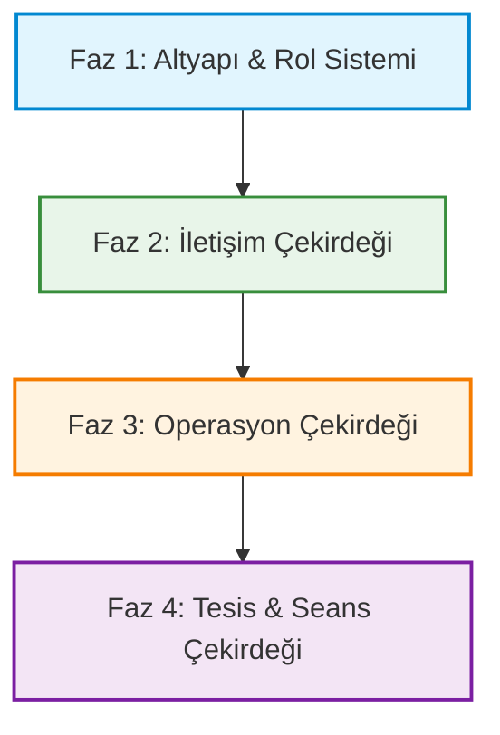

# 🗺️ Apartman Plus Resident Ops - Mühendislik Yol Haritası ve Ajan Yönetim Protokolü (v1.0.0)

Bu doküman, **Apartman Plus Resident Ops** projesinin temiz, ölçeklenebilir ve multi-tenant (çok kiracılı) mimaride aşamalı olarak geliştirilmesi için hazırlanmış ana planlama kılavuzudur.

Dokümanda yer alan fazlar ve ajan (agent) yönlendirmeleri, **ASANMOD Enterprise Engine (v1.0.0)** standartlarına tam uyumlu olup sıfır tolerans (fail-close) ilkesi gözetilerek yapılandırılmıştır.

---

## 🏗️ 1. Mimari ve Temel Prensipler

### 🌍 1.1. Multi-Tenant İzolasyon Mimarisi

Uygulama, veritabanı düzeyinde mantıksal izolasyon (logical isolation) üzerine inşa edilecektir:

- Tüm operasyonel tablolar doğrudan veya dolaylı olarak bir `siteId` (Tenant) alanına bağlıdır.
- **Global Query Filter:** tRPC prosedürleri, middleware katmanında kullanıcının aktif site oturumunu (`siteId`) doğrular ve tRPC Context içerisine enjekte eder. Context dışından gelen filtreler reddedilir.
- **Çift Katmanlı Üyelik (Membership) Modeli:** `User` (Global kimlik) ve `Membership` (Site bazlı rol ve daire) ayrılmıştır. Bir kullanıcı birden fazla sitede üye olabilir; ancak her sitenin verisi tRPC Context düzeyinde kesin olarak izole edilir.

### 🔐 1.2. Dinamik Yetkilendirme (Dynamic RBAC)

Sabit roller yerine dinamik yetki setleri kullanılır:

- Yetkiler (`permissions`) bir metin dizisi (`String[]`) olarak `Role` tablosunda saklanır (Örn: `["VIEW_VISITORS", "CREATE_PACKAGES"]`).
- Backend yetki denetimi için tRPC prosedürlerine entegre edilmiş özel bir `hasPermission` koruyucu middleware'i kullanılır.

---

## 🏁 2. Faz ve Modül Bölümlemesi



---

## 🛠️ Faz 1: Altyapı & Rol Yetki Sistemi (Modül 1 & 2)

### 📁 Modül 1.1: Veritabanı ve Multi-Tenant Altyapısı (Drizzle ORM)

Drizzle ORM kullanarak PostgreSQL üzerinde multi-tenant ilişkileri tanımlanır.

#### 🗄️ Drizzle Şema Tasarımı (`src/db/schema/`):

```typescript
import {
  pgTable,
  text,
  timestamp,
  uuid,
  boolean,
  jsonb,
} from "drizzle-orm/pg-core";

// Site (Tenant)
export const sites = pgTable("sites", {
  id: uuid("id").primaryKey().defaultRandom(),
  name: text("name").notNull(),
  address: text("address"),
  createdAt: timestamp("created_at").defaultNow().notNull(),
});

// Bloklar
export const blocks = pgTable("blocks", {
  id: uuid("id").primaryKey().defaultRandom(),
  siteId: uuid("site_id")
    .references(() => sites.id)
    .notNull(),
  name: text("name").notNull(), // Örn: "A Blok"
});

// Daireler / Bölümler
export const units = pgTable("units", {
  id: uuid("id").primaryKey().defaultRandom(),
  blockId: uuid("block_id")
    .references(() => blocks.id)
    .notNull(),
  unitNumber: text("unit_number").notNull(), // Örn: "Daire 42"
});

// Global Kullanıcı
export const users = pgTable("users", {
  id: uuid("id").primaryKey().defaultRandom(),
  email: text("email").notNull().unique(),
  fullName: text("full_name").notNull(),
  passwordHash: text("password_hash").notNull(),
  createdAt: timestamp("created_at").defaultNow().notNull(),
});

// Dinamik Roller (Siteye özel roller oluşturulabilir, siteId null ise global şablon roldür)
export const roles = pgTable("roles", {
  id: uuid("id").primaryKey().defaultRandom(),
  siteId: uuid("site_id").references(() => sites.id),
  name: text("name").notNull(), // Örn: "Gece Güvenliği"
  permissions: jsonb("permissions").$type<string[]>().default([]).notNull(), // Örn: ["VIEW_VISITORS"]
});

// Üyelik Bağlantısı (Kullanıcıyı Site ve Daire ile eşleştirir, rolünü tanımlar)
export const memberships = pgTable("memberships", {
  id: uuid("id").primaryKey().defaultRandom(),
  userId: uuid("user_id")
    .references(() => users.id)
    .notNull(),
  siteId: uuid("site_id")
    .references(() => sites.id)
    .notNull(),
  unitId: uuid("unit_id").references(() => units.id), // Opsiyonel (Sakin ise zorunlu, görevli ise null olabilir)
  roleId: uuid("role_id")
    .references(() => roles.id)
    .notNull(),
  isActive: boolean("is_active").default(true).notNull(),
});

// Detaylı Aksiyon Denetim Logları
export const auditLogs = pgTable("audit_logs", {
  id: uuid("id").primaryKey().defaultRandom(),
  siteId: uuid("site_id")
    .references(() => sites.id)
    .notNull(),
  actorId: uuid("actor_id")
    .references(() => users.id)
    .notNull(),
  action: text("action").notNull(), // Örn: "CREATE_TICKET", "DELIVER_PACKAGE"
  entity: text("entity").notNull(), // Örn: "Ticket", "Package"
  oldValue: jsonb("old_value"),
  newValue: jsonb("new_value"),
  timestamp: timestamp("timestamp").defaultNow().notNull(),
});
```

### 📁 Modül 1.2: tRPC Context & Çoklu Site Oturumu (Context Switching)

- Kullanıcı tek bir hesapla sisteme girer; ancak üye olduğu siteler arasında hızlıca geçiş yapabilir.
- Her istekte tRPC Context aracılığıyla aktif `siteId` ve `roleId` çözümlenir, yetkiler veritabanı filtrelerine otomatik enjekte edilir.

---

## 🛠️ Faz 2: İletişim Çekirdeği (Modül 3 & 4)

### 📁 Modül 2.1: Bildirim Merkezi

- **Tablo:** `Notification` (id, siteId, recipientUserId, type, title, message, isRead, relatedEntityId, relatedEntityType).
- **Kurallar:** Uygulama içi (in-app) anlık bildirim listeleme, okunmamış badge sayısı ve bildirim kartına tıklanıldığında ilgili operasyonel sayfaya (Örn: Paket Detayı) otomatik yönlendirme.

### 📁 Modül 2.2: Duyuru ve Acil Bildirim Sistemi

- **Tablo:** `Announcement` ve `AnnouncementReadReceipt` (Okunma durum raporu).
- **Kurallar:** Duyuru yayınlandığında tüm sakinlere bildirim gider. Duyurular NORMAL, IMPORTANT, URGENT olmak üzere üç öncelik derecesine sahiptir. Sakin duyuruyu açtığında `ReadReceipt` kaydı oluşturulur.

---

## 🛠️ Faz 3: Günlük Yaşam Operasyonları (Modül 5, 6 & 7)

### 📁 Modül 3.1: Talep & Arıza Takip Modülü (SLA & Blok Bazlı Atama)

- **Tablo:** `Ticket` (kategori, status [OPEN, IN_PROGRESS, RESOLVED, CANCELLED], assignedStaffId, blockId).
- **Görevli Atama Kuralı:** Staff rolündeki görevliler, sadece kendilerine atanan **Bloklar** (`blockId`) altındaki talepleri listeleyebilir ve müdahale edebilirler.

### 📁 Modül 3.2: Ziyaretçi Ön Kayıt & Check-In Modülü

- **Tablo:** `VisitorPass` (unitId, visitorName, status [EXPECTED, CHECKED_IN, CANCELLED], visitDate, expectedTime, checkedInAt).
- **Kurallar:** Sakin beklenen misafir kaydını oluşturur. Güvenlik resepsiyon paneli sadece o güne ait beklenen misafirleri listeler ve gelen misafiri `CHECKED_IN` olarak onaylar.

### 📁 Modül 3.3: Paket & Kargo Takip (OTP Doğrulama Mimarisi)

- **Tablo:** `PackageDelivery` (unitId, carrierName, otpCode, status [RECEIVED, DELIVERED], receivedAt, deliveredAt).
- **İş Akışı:** Resepsiyon paketi teslim aldığında sistem 6 haneli benzersiz bir `otpCode` oluşturur ve sakine anlık bildirim gönderir. Güvenlik personeli, paketi sakine fiziksel olarak teslim ederken sakinin telefonundaki bu OTP kodunu doğrulamak zorundadır. Doğrulama başarılı olmadan paket statüsü `DELIVERED` yapılamaz.

---

## 🛠️ Faz 4: Rezervasyon & Tesis Yönetimi (Modül 8)

### 📁 Modül 4.1: Seans Bazlı Rezervasyon & Eşzamanlılık Kontrolü

- **Tablolar:** `Amenity` (Gym, Havuz vb.), `AmenitySession` (Seanslar; startTime, endTime, capacity) ve `AmenityReservation` (Sakin rezervasyonları).
- **Eşzamanlılık Kontrolü:** Aynı zaman dilimi için rezervasyon oluşturulurken backend katmanında iş parçacığı/transaction seviyesinde `count(reservations) < capacity` doğrulaması yapılır. Kapasite aşılamaz.

---

## 🤖 3. ASANMOD Uyumlu Ajan Geliştirme Promtları

Aşağıdaki promtlar, sıradaki geliştirme aşamalarını yürütecek yapay zeka kodlama ajanlarına doğrudan verilmek üzere tasarlanmıştır.

### 🌟 MASTER PROMPT (Tüm Ajanların Başlamadan Önce Okuması Gereken Kurallar)

```markdown
Sen, Apartman Plus Resident Ops projesinin full-stack geliştirme mimarısın.
Geliştirmeyi yaptığın bu depo ASANMOD Enterprise Engine (v1.0.0) standartları ile korunmaktadır.
Aşağıdaki kurallara UYMAK ZORUNDASIN:

1. Llocked Dosya Politikası: "package-lock.json", "docs/asanmod-core.json" ve ".asanmod/manifest.json" dosyalarını koru.
2. Sıfır Tolerans (0/0/0): Herhangi bir kod yazımı sonrasında "npm run verify" komutunun hatasız geçmesi zorunludur.
3. Mimari Sınırlar: Yeni oluşturduğun tüm dosyalar "config/asanmod-universal/architecture-map.json" haritasındaki onaylanmış dizinlerde ve uzantılarda olmalıdır. Bilinmeyen bir klasörde dosya oluşturursan yapısal kontrol (structure_check) hata verir ve CI/CD bloklanır.
4. Commit Biçimi: Tüm commit mesajların `type(scope): message` standartına uymalıdır (Örn: feat(auth): add context switched session).
5. Placeholder Yasaktır: Kodda kesinlikle "// TODO: implement later" veya yarım bırakılmış arayüz/fonksiyon tanımları olmamalıdır. Tüm kodlar üretime hazır, tam işlevsel olmalıdır.
6. Modern Arayüz Standardı: Vanilla CSS ile premium glassmorphism, responsive gridler, modern tipografi (Outfit/Inter Google Fonts) ve akıcı mikro animasyonlar kullan. Arayüzün görsel kalitesi premium hissettirmelidir.
```

---

### 🔑 Faz 1 Promtu: Multi-Tenant Altyapı ve Rol-Yetki Sistemi

```markdown
Görev: Faz 1 - Multi-Tenant Temel Altyapı ve Dinamik RBAC Geliştirme

Lütfen aşağıdaki adımları sırasıyla, eksiksiz ve production-ready olarak kodla:

1. Veri Modeli Tanımı (Drizzle ORM):
   - `src/db/schema/` klasörü altında `sites.ts`, `blocks.ts`, `units.ts`, `roles.ts`, `memberships.ts` ve `auditLogs.ts` şemalarını oluştur.
   - Bu şemaları `src/db/schema.ts` ve `src/db/schema/index.ts` dosyalarında import edip re-export et.

2. tRPC Multi-Tenant Middleware & Context:
   - Kullanıcının aktif `siteId` oturumunu çözecek tRPC Context yapısını kur.
   - Tüm sorgularda veritabanı işlemlerini context'ten gelen `siteId` parametresine filtre uygulayarak gerçekleştir.
   - Yetki denetimi sağlayan koruyucu bir `hasPermission` tRPC middleware'i geliştir.

3. Rol Yönetimi & Context Switcher Ekranları:
   - SITE_ADMIN rolünün siteye özel "Gece Güvenliği", "Concierge" gibi yeni dinamik roller tanımlayabileceği bir rol oluşturma ekranı yap.
   - Çoklu üyeliği olan kullanıcıların aktif çalıştıkları siteyi/daireyi seçebilecekleri bir "Site Switcher" arayüz bileşeni geliştir.

ASANMOD Uyarısı: Kodlamayı bitirdikten sonra "npm run verify" komutunu çalıştırarak tüm kalite kapılarının (eslint, format, structure, type-check) geçtiğini doğrula. Commit atarken "feat(auth): implement multi-tenant RBAC engine" mesaj biçimini kullan.
```

---

### 📢 Faz 2 Promtu: İletişim Çekirdeği (Bildirim & Duyurular)

```markdown
Görev: Faz 2 - Bildirim Merkezi ve Duyuru Yönetimi Geliştirme

Lütfen aşağıdaki adımları sırasıyla, eksiksiz ve production-ready olarak kodla:

1. Bildirim Altyapısı:
   - `Notification` modelini oluştur (Drizzle).
   - Uygulama içi (in-app) anlık bildirim listesini gösteren bir bildirim çekmecesi (drawer) arayüzü tasarla.
   - Okunmamış badge sayacı, tümünü okundu işaretleme ve bildirim tipine göre ilgili operasyonel rotaya dinamik redirect yönlendirmesi sağla.

2. Duyuru Sistemi:
   - `Announcement` ve `AnnouncementReadReceipt` şemalarını yaz.
   - Yönetim paneli için NORMAL, IMPORTANT, URGENT öncelik seviyelerine sahip duyuru oluşturma formunu yap.
   - Sakin arayüzünde duyuruları tarih sırasına göre listele. Sakin detay sayfasına girdiğinde backend'de anlık `ReadReceipt` kaydı oluştur.

ASANMOD Uyarısı: Arayüz tasarımlarında Outfit fontu, akıcı mikro-animasyonlar ve responsive şablonlar kullan. Bitiminde "npm run verify" komutu sıfır hata ile geçmelidir. Commit biçimi: "feat(notify): add notification drawer and announcements".
```

---

### 📦 Faz 3 Promtu: Günlük Yaşam Operasyonları (Talep, Ziyaretçi & OTP'li Paket)

```markdown
Görev: Faz 3 - Talep Yönetimi, Ziyaretçi Ön Kayıt ve OTP Güvenlikli Paket Teslimat Sistemleri

Lütfen aşağıdaki adımları sırasıyla, eksiksiz ve üretim standartlarında kodla:

1. Talep & Arıza (Ticket) Sistemi:
   - `Ticket`, `TicketActivity` ve `TicketAttachment` şemalarını oluştur.
   - Sakinlerin teknik arıza, temizlik vb. kategorilerde fotoğraf ekiyle talep açabileceği formu kodla.
   - Staff rolünün sadece kendi atanmış olduğu `blockId` altındaki talepleri listeleyebileceği yetkilendirilmiş rota filtrelemesini backend'de uygula.

2. Ziyaretçi Yönetimi:
   - `VisitorPass` şemasını yaz.
   - Sakin tarafında beklenen misafir (ad, tarih, saat, not) ön kayıt ekranını yap.
   - Güvenlik görevlisinin sadece o güne ait beklenen misafirleri görebileceği ve girişte "Check-in" durumuna güncelleyebileceği Güvenlik Panelini kodla.

3. OTP Güvenlikli Paket / Kargo Akışı:
   - `PackageDelivery` şemasını yaz.
   - Güvenlik gelen kargoyu sisteme kaydettiğinde anlık 6 haneli rastgele bir `otpCode` üret. Sakine bildirim tetikle.
   - Güvenlik panelinde paketin teslim edilebilmesi için sakinden alınan OTP kodunu doğrulayacak "/packages/:id/verify-otp" tRPC aksiyonunu ve doğrulama arayüzünü kodla. OTP doğrulanmadan statü `DELIVERED` olmamalıdır.

ASANMOD Uyarısı: Geliştirme sonunda "npm run verify" komutu hatasız çalışmalıdır. Commit biçimi: "feat(ops): implement secure package delivery and visitor flows".
```

---

### 🏊 Faz 4 Promtu: Tesis Seansları ve Eşzamanlı Rezervasyon

```markdown
Görev: Faz 4 - Seans Bazlı Tesis Rezervasyon Sistemi ve Eşzamanlılık Kontrolü

Lütfen aşağıdaki adımları sırasıyla, eksiksiz ve production-ready olarak kodla:

1. Rezervasyon Veri Modeli:
   - `Amenity` (Tesisler), `AmenitySession` (Seanslar) ve `AmenityReservation` (Rezervasyonlar) şemalarını oluştur.
   - Yönetici panelinde tesislere seans (başlangıç, bitiş saati ve maksimum seans kapasitesi) tanımlayabilen arayüz ve backend endpoint'lerini yaz.

2. Eşzamanlılık ve Kapasite Denetimi:
   - Sakin tarafında rezervasyon talebi gönderildiğinde, backend'de seansın anlık doluluk sayısını (`count(reservations)`) kontrol et.
   - Race-condition (eşzamanlılık çakışması) durumlarını önlemek için veritabanı transaction katmanında güvenli kontrol mekanizması kur. Seans dolduysa "Kapasite dolu" hatası fırlat.
   - Rezervasyon başarıyla oluşturulduysa sakine onay bildirimi gönder. Sakinin rezervasyon geçmişi listeleme ve rezervasyon iptal ekranlarını kodla.

ASANMOD Uyarısı: Tüm kodlar tam işlevsel olmalıdır. "npm run verify" kontrollerinin tamamının geçtiğini doğrula. Commit biçimi: "feat(booking): add amenity reservation engine with capacity controls".
```

---

## 🏁 4. Sonuç ve Ajan Geliştirme Akışı

Geliştirmeyi sürdürecek ajanlar, bu yol haritasında tanımlanan fazları yukarıdaki **Faz Promtlarını** sırasıyla kullanarak geliştireceklerdir.

_Yol Haritası ASANMOD Kalite Yönetim Protokolü v1.0.0 ile mühürlenmiştir._
